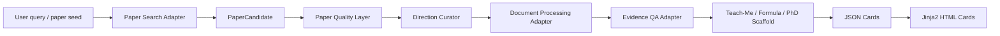

# 生模系统架构

## 数据流



## 层职责

`Paper Search Layer` 只调用外部工具，不自研搜索。  
`Paper Quality Layer` 做规则化质量预筛，不判断“造假”，只标注风险信号。  
`Direction Curator` 把方向压缩成少量高质量论文路线。  
`Evidence QA Layer` 负责证据定位，后续接 PaperQA2。  
`Teach-Me Layer` 负责中文讲解、概念补课、公式拆解。  
`PhD Training Layer` 负责 claim/evidence/assumption/weak point/research question。  
`Presentation Layer` 用 Jinja2、KaTeX、Mermaid 输出静态 HTML。

## 当前实现状态

已实现：

- schema：`research_sensei/schemas.py`
- 配置系统：`research_sensei/config.py`
- 模型网关：`research_sensei/model_gateway.py`
- Web App：`research_sensei/web/app.py`
- 上传和任务系统：`research_sensei/services/uploads.py`、`research_sensei/jobs.py`
- 任务流水线：`research_sensei/pipeline.py`
- 质量规则：`research_sensei/core/quality.py`
- 方向压缩：`research_sensei/core/direction.py`
- 科研模式：`research_sensei/core/patterns.py`
- 搜索薄 Adapter：`research_sensei/adapters/search.py`
- Evidence QA 薄 Adapter：`research_sensei/adapters/evidence.py`
- HTML 渲染：`research_sensei/renderer/html.py`
- 6 个模板：`research_sensei/templates/`
- Web 模板：`research_sensei/web/templates/`

未实现但已留接口：

- 真实 `paper-search-mcp` 安装和调用验证。
- Docling/Marker/GROBID 解析后端选择。
- PaperQA2 真实 evidence QA。
- py-fsrs 真实复习时间计算。
- promptfoo/Ragas 评测。

## Web 路由

```text
GET  /
GET  /settings
POST /settings/test
GET  /search
GET  /papers/upload
POST /papers/upload
GET  /jobs/{job_id}
POST /jobs/{job_id}/run
GET  /cards/{job_id}
GET  /cards/{job_id}/{card_type}
GET  /artifacts/{job_id}/download
```

## 外部工具缺失策略

缺少 Docling、PaperQA2、paper-search-mcp、py-fsrs 或模型 API key 时，系统必须给出清晰错误并保留 job 状态，不允许自动退回自研 parser、crawler 或 RAG。
